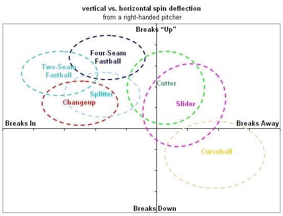

# Algorithm

Decision trees are the machine learning equivalent of 20 questions. Given an input, the tree navigates from the root to a leaf node (representing some classification or regression value), following conditions at each branch that best separate the data.  Each split aims to maximize information gain according to some criterion that gives the most homogeneous grouping at the leaves. When the traversal reaches a terminal node, the assigned label or numerical value is determined. Further specifics and the algorithm are in the code

# Problem
In baseball, a pitcher can vary the pitches they throw with each type of pitch following a unique trajectory and having a distinct speed. As such, given information about the movement of the pitch, can we classify it with a decision tree?

# Dataset
We will be the [PyBaseball API](https://github.com/jldbc/pybaseball/tree/master). Specifically, we will read Statcast data for the 2025 regular season. Statcast is a tool developed by the MLB to track various variables regarding pitches and hitting. We will be considering the following to predict if a pitch type
* release_speed -  pitch velocity
* release_spin_rate - pitch spin rate
* pfx_x - horizontal movement in feet from the catcher's perspective
* pfx_z - vertical movement in feet from the catcher's perspective