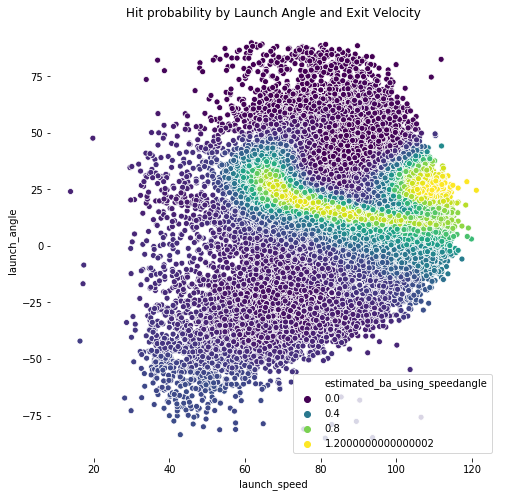

# Algorithm
A neural network works by passing an input through many layers of interconnected neurons (like our perceptron from earlier), each applying a transformation inspired by some activation function (sigmoid in our case), which introduces non-linearity to help the model capture complex patterns. Each neuron takes a weighted sum of its inputs, applies its activation function, and sends the result forward. The network learns by adjusting these weights using a method called backpropagation, which minimizes the categorical cross-entropy (similar to logistic regression). All of these factors allows the neural network to learn complex non-linear patterns. Further specifics and the algorithm are in the code.

# Problem
While looking for baseball APIs, I came across the following example in the [PyBaseball documentation](https://github.com/jldbc/pybaseball/blob/master/EXAMPLES/fivethirtyeight_new_science_of_hitting.ipynb) showing the launch speed and angle when a ball is hit and the probability of the ball being an actual hit (ie, not a foul or out). This inspired me to ask the following question: given a pitch and the corresponding contact with the bat, can we predict if it is a home run?

# Dataset
We will be the [PyBaseball API](https://github.com/jldbc/pybaseball/tree/master). Specifically, we will read Statcast data for the 2024 regular season. Statcast is a tool developed by the MLB to track various variables regarding pitches and hitting. We will be considering the following in order to predict home runs
* Launch Speed - Exit velocity of the batted ball  
* Launch Angle - Launch angle of the batted ball
* plate_z - Vertical position of the ball when it crosses home plate from the catcher's perspective.
* pfx_z - Horizontal movement of pitch in feet from the catcher's perspective.\
* home team - which home team is playing
